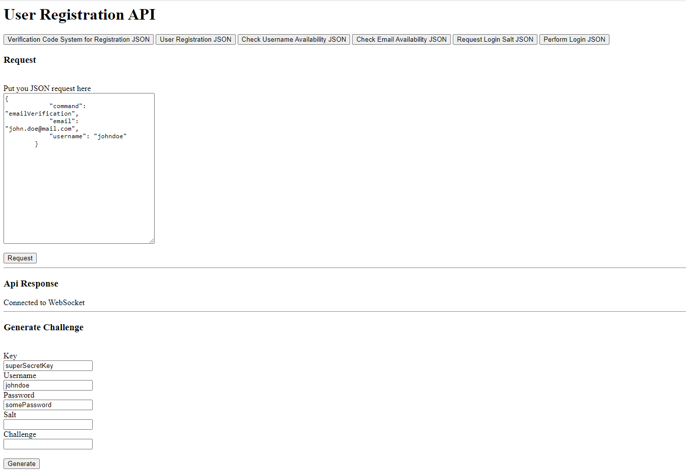

# User Registration API


## About The Project


### Built With
* C#/ASP.NET Core 3.1
* [System.Net.WebSockets](https://www.nuget.org/packages/System.Net.WebSockets/4.3.0)
* [Microsoft.EntityFrameworkCore](https://www.nuget.org/packages/Microsoft.EntityFrameworkCore/5.0.0)
* [FluentValidation](https://www.nuget.org/packages/FluentValidation/8.6.1)
* [NETCore.MailKit](https://www.nuget.org/packages/NETCore.MailKit/2.0.3)


<!-- GETTING STARTED -->
## Getting Started

This section give instructions on setting up your project locally.
To get a local copy up and running follow these simple example steps.

### Prerequisites

The project uses .Net Core 3.1, make sure that it is installed on your machine. Get the installer [here](https://dotnet.microsoft.com/download/dotnet-core/3.1).

There are many ways on how to run this project. One is using the dotnet command but in the instructions below I used Visual Studio.

The project uses [SQL Server](https://www.nuget.org/packages/Microsoft.EntityFrameworkCore.SqlServer/5.0.0) as database provider but you can also use other provider check this [link](https://docs.microsoft.com/en-us/ef/core/providers/?tabs=dotnet-core-cli) to see other providers.

### Installation
1. Clone the repo
   ```sh
   git clone https://github.com/norikorebolledo/UserRegistration.git
   ```
2. Restore Packages

    In Visual Studio, just build the solution and it will automatically restore the packages or right click in the solution folder and click "Restore Nuget Packages" 
3. Apply database migration
 
    1. Change the connection string in the appsettings.Development.json under UserRegistration.Api project
    2. Open Package Manager Console
    3. Set UserRegistration.Data.Sql project as a default project
    4. Run Update-Database in the console
   
5. Set UserRegistration.Api project as your startup project and run the visual studio


## Testing

### UI Test
Use the simple UI in the root URL to test the calls in WebSocket. You may check the API response below. Refer to the image below:


You may click the buttons to add example json request on the textarea and click the "Request" button below to call a request to the WebSockets

### Unit Test
The solution also contains Unit Testing to test the business requirements. You can find it under the Test folder.


### WebSocket
You can use websocket by using the prefix using the prefix /ws

Here are the example of the javascript call:

```javascript
var uri = "wss://" + window.location.host + "/ws";
var socket = new WebSocket(uri);

```

## Other Settings
### Mail
You can add also a mail settings to send email by configuring it on the appsettings.Development.json
``` json  
"MailSettings": {
    "Mail": null,
    "DisplayName": null,
    "Password": null,
    "Host": null,
    "Port": null
  },
```

but by default it was set to devmode to by pass the sending of email, you can change it in SecuritySettings.DevMode in appsettings.Development.json

``` json
  "SecuritySettings": {
    "DevMode": true
  }

```

### Security
You may also change some security settings, you can find it on appsettings.Development.json
``` json
  "SecuritySettings": {
    "SecretKey": "",
    "SessionValidityInSeconds": 60,
    "SaltValidityInSeconds": 300,
    "VerificationLimitPerDay": 2
  },

```


